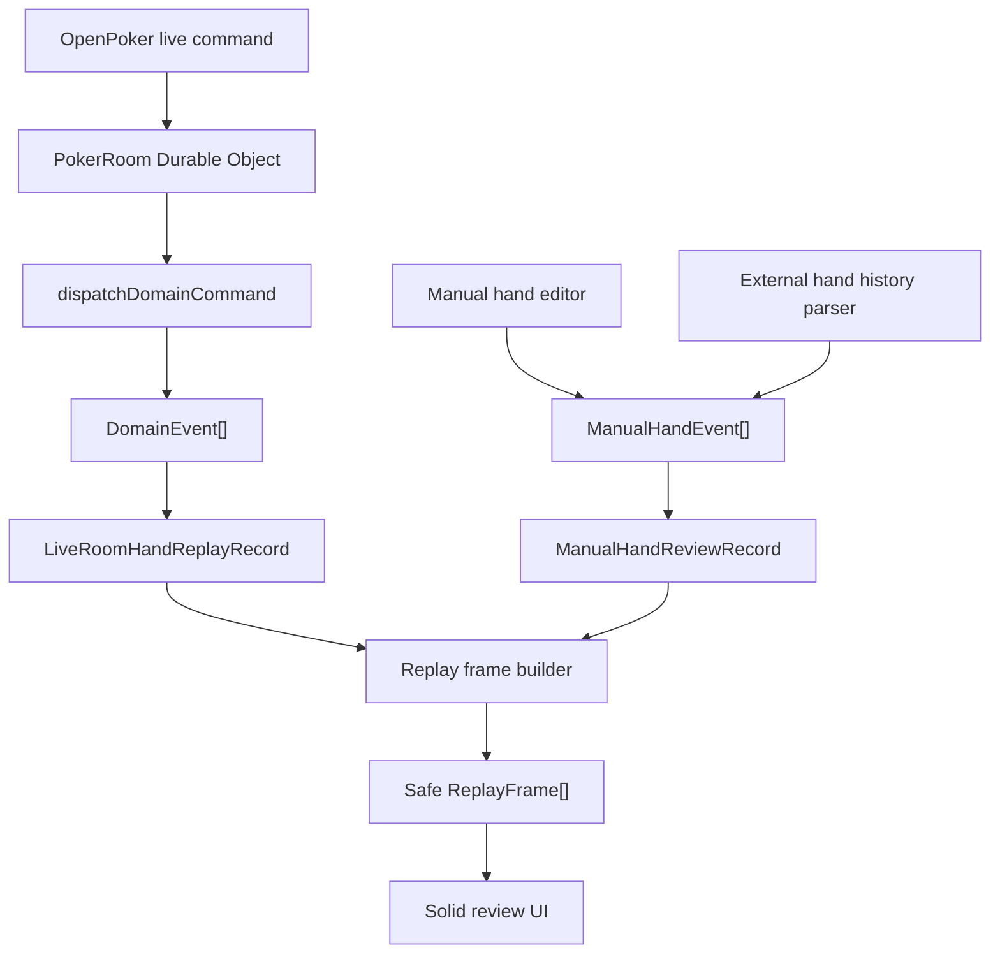

# Hand Review Replayer Plan

## 목적

이 문서는 OpenPoker 안에 "포커 핸드 복기 리플레이어"를 추가하기 위한 상세 구현 계획이다.

목표는 예전 `poker-hand-review` 사이트의 장점인 커서 기반 복기 경험을 가져오되, 실제 포커 상태 계산은 현재 OpenPoker의 domain engine을 기준으로 구현하는 것이다.

한 줄로 정리하면 아래와 같다.

> 현재 라이브 포커 게임에서 발생하는 `DomainEvent[]`를 핸드 단위로 저장하고, 그 이벤트 스트림을 커서 단위로 재생해 복기 화면을 만든다.

## 배경

현재 OpenPoker는 라이브 테이블 진행을 위한 기반을 이미 많이 갖고 있다.

- `packages/domain`은 command를 검증하고 `DomainEvent[]`를 만든다.
- reducer는 event를 다시 적용해 상태를 재현할 수 있다.
- Durable Object는 authoritative room state를 소유한다.
- web client는 server snapshot을 기준으로 테이블 UI를 렌더링한다.

하지만 아직 없는 것은 아래다.

- 완료된 핸드의 이벤트 로그 보관
- 완료된 핸드 목록 API
- 특정 핸드의 replay record 조회 API
- cursor 기반 replay projection
- replay 전용 web 화면
- 공개 공유 링크에서 숨겨야 하는 카드/덱 정보 제거

따라서 이 작업은 "새 포커 엔진을 만드는 일"이 아니라, 이미 있는 event-sourced domain 구조를 제품 기능으로 끌어내는 일이다.

## 참고한 기존 프로젝트

예전 `poker-hand-review` 프로젝트에서 가져올 핵심 아이디어는 아래다.

- event array가 hand review의 single source of truth다.
- cursor는 `0..events.length` 범위를 가진다.
- 특정 cursor의 table state는 `events.slice(0, cursor)`를 reduce해서 만든다.
- record mode와 review mode는 같은 table UI를 공유하되 입력 가능 여부만 다르다.
- event log에서 특정 항목을 클릭하면 그 시점으로 점프한다.
- 이전/다음 액션 버튼으로 hand를 한 단계씩 복기한다.
- 저장된 hand는 share token으로 공유할 수 있다.

하지만 그대로 가져오지 않을 부분도 명확하다.

- 예전 reducer, betting 계산, legal action 계산은 OpenPoker domain engine으로 대체한다.
- 예전 React/Zustand UI 코드는 Solid 기반 OpenPoker에 직접 이식하지 않는다.
- 예전 `TimelineEvent` 타입은 현재 `DomainEvent`와 의미가 다르므로 그대로 쓰지 않는다.
- 현재 OpenPoker의 hidden card / deck 보안 정책을 우선한다.

## 핵심 원칙

### 1. `DomainEvent`를 replay source로 사용한다

OpenPoker에는 이미 아래 이벤트들이 있다.

- `hand-started`
- `action-applied`
- `street-advanced`
- `hand-awarded-uncontested`
- `showdown-settled`

이 이벤트들은 reducer가 재계산 없이 적용할 수 있도록 결정된 사실을 담고 있다.

예:

- 실제 blind posting
- hole card assignment
- remaining deck
- validated action
- burn card / board card
- showdown evaluation
- pot awards / payouts

따라서 별도의 replay 전용 event language를 새로 만들지 않는다.

### 2. replay record는 hand 단위로 저장한다

라이브 룸 전체 state를 계속 저장하는 것만으로는 과거 핸드를 복기할 수 없다.

각 hand마다 최소 아래가 필요하다.

- hand 시작 직전 initial state
- hand 중 발생한 domain events
- hand 완료 summary
- 생성/완료 시각
- 공개 가능 여부와 접근 정책

### 3. raw event stream은 공개 API로 그대로 노출하지 않는다

`DomainEvent`에는 숨겨야 하는 정보가 포함될 수 있다.

- 모든 플레이어의 hole cards
- remaining deck order
- burn cards
- showdown 전에는 공개되지 않아야 하는 카드 정보

따라서 owner/debug/internal 용도와 public/share 용도를 분리한다.

공개 replay API는 raw internal event가 아니라, 안전하게 projection된 replay frames 또는 sanitized replay event를 반환해야 한다.

### 4. replay state도 server projection을 기준으로 한다

web client가 chip count, pot, winner, board reveal을 자체 계산하지 않는다.

client는 아래 중 하나를 받는다.

- cursor별 `PublicTableView`에 가까운 safe frame
- replay record와 server-approved event summaries

MVP에서는 client가 `DomainEvent`를 직접 reduce하지 않고, worker/domain helper가 만든 safe replay payload를 받는 쪽이 안전하다.

### 5. 현재 라이브 테이블과 replay 테이블은 UI를 공유하되 controller는 분리한다

라이브 테이블은 websocket snapshot이 source of truth다.

리플레이 화면은 replay record + cursor가 source of truth다.

공유 가능한 UI:

- card rendering
- chip rendering
- seat card
- board / pot display
- showdown summary

분리해야 하는 UI:

- action buttons
- websocket controller
- session resume
- turn timer mutation
- auto-start / seat claim flow

### 6. 리플레이어는 두 종류의 hand source를 지원해야 한다

이 제품은 단순히 "OpenPoker 라이브 게임에서 끝난 핸드 다시 보기"만을 위한 기능이 아니다.

최종 목표는 아래 두 종류의 핸드를 모두 복기하는 것이다.

1. OpenPoker 안에서 실제로 플레이된 핸드
2. 다른 온라인 포커 사이트나 오프라인 게임에서 사용자가 기억하거나 기록해 둔 핸드

두 source는 생성 방식이 다르다.

OpenPoker live hand:

- 서버가 이미 모든 사실을 알고 있다.
- `InternalRoomState`와 `DomainEvent[]`가 있다.
- replay는 domain reducer를 그대로 사용할 수 있다.
- hand 결과와 pot award가 엔진에 의해 확정된다.

External / offline manual hand:

- OpenPoker 서버가 실제 게임을 진행하지 않았다.
- 사용자가 seat, stack, blind, button, cards, actions를 직접 입력한다.
- 외부 hand history text를 붙여넣어 parser가 만들 수도 있다.
- 기억나는 핸드는 일부 정보가 비어 있을 수 있다.
- 현재 `DomainEvent`로 억지 변환하면 오히려 불안정할 수 있다.

따라서 저장 모델은 source를 분리하되, UI가 받는 replay frame은 최대한 공유한다.

```text
LiveRoomHandReplayRecord -> ReplayFrame[]
ManualHandReviewRecord  -> ReplayFrame[]
ImportedHandReviewRecord -> ManualHandReviewRecord -> ReplayFrame[]
```

핵심은 "입력 record는 다를 수 있지만, 복기 화면은 같은 frame protocol을 본다"는 것이다.

## MVP 범위

### 포함한다

- 현재 room에서 완료된 hand 목록 조회
- OpenPoker live hand replay record 저장
- manual hand review record 생성
- manual hand review detail 조회
- replay detail 조회
- replay cursor 이동
- 이전/다음 액션 버튼
- timeline event log
- board / seats / pot / showdown summary 표시
- owner 또는 room participant 기준의 private replay 조회
- public replay에서는 hidden cards와 deck order를 숨김
- 다른 포커 사이트/오프라인 핸드를 직접 입력해서 복기하는 기본 editor

### 포함하지 않는다

- 외부 PokerStars / GG Poker hand history parser
- 예전 `poker-hand-review` hand data 전체 migration
- solver / GTO analysis
- equity graph
- note-taking / comments
- multi-table hand database search
- D1 기반 영구 hand archive
- public share token

위 항목들은 MVP 이후 단계로 둔다.

중요:

- 외부 hand history "자동 parser"는 MVP에서 제외한다.
- 하지만 외부/오프라인 hand를 "직접 입력해서 복기"하는 기능은 MVP 범위에 포함한다.

## 최종 사용자 경험

### Live hand 목록

사용자는 room 화면 또는 별도 review 화면에서 최근 완료 hand 목록을 볼 수 있다.

예:

- Hand #12
- NLH 1/2
- 2026-04-30 22:31
- Winner: Alice
- Pot: 186
- Board: Ah Ks 7d 3c 2s

### Manual hand 생성

사용자는 OpenPoker 밖에서 발생한 핸드를 직접 입력할 수 있다.

예:

- ACR / PokerStars / GG Poker에서 기억나는 스팟
- 라이브 카지노에서 플레이한 핸드
- 친구들과 오프라인으로 친 홈게임 핸드
- 코칭 중 다시 보고 싶은 가상 hand

입력 flow:

1. 게임 타입 선택
2. 블라인드 / ante / currency 입력
3. 플레이어 수와 seat 설정
4. button seat 설정
5. 플레이어 이름과 시작 stack 입력
6. hero seat와 known hole cards 입력
7. preflop부터 river까지 action 입력
8. board cards 입력
9. showdown reveal 또는 winner 입력
10. 저장 후 replay 화면으로 이동

MVP에서는 strict mode와 memory mode를 구분할 수 있다.

Strict mode:

- 시작 stack과 모든 action amount가 필요하다.
- street 진행이 pot / stack 계산과 맞지 않으면 오류로 막는다.
- 분석과 공유에 적합하다.

Memory mode:

- 일부 stack, hole card, exact sizing이 비어 있어도 저장할 수 있다.
- 불완전한 정보는 `unknown` 또는 `estimated`로 표시한다.
- 오프라인에서 기억나는 스팟을 빠르게 재현하는 데 적합하다.

### 리플레이 화면

리플레이 화면은 아래 영역으로 구성한다.

- 상단: hand metadata
- 중앙: poker table
- 하단: replay controls
- 측면 또는 하단: event timeline

컨트롤:

- 처음으로
- 이전 이벤트
- 재생/일시정지
- 다음 이벤트
- 마지막으로
- cursor slider

timeline 항목:

- hand started
- blinds posted
- Alice calls 2
- Bob raises to 8
- flop Ah Ks 7d
- Alice checks
- Bob bets 12
- showdown
- Alice wins 72

### cursor 의미

`events.length = N`일 때 cursor 범위는 `0..N`이다.

- `cursor = 0`: hand 시작 직전 initial state
- `cursor = 1`: 첫 번째 event 적용 후
- `cursor = N`: 모든 event 적용 후 최종 hand state

이 규칙은 예전 `poker-hand-review`의 cursor replay 모델과 거의 같다.

## 아키텍처 개요

리플레이어는 두 입력 source를 가진다.



## 데이터 모델

### `HandReviewRecord`

상위 record는 source에 따라 분기한다.

```ts
type HandReviewRecord = LiveRoomHandReplayRecord | ManualHandReviewRecord;
```

두 record는 내부 source data가 다르지만, replay UI에 전달될 때는 같은 `HandReplayFrame` 또는 `HandReviewFrame` 형태로 projection된다.

### `LiveRoomHandReplayRecord`

초기 구현은 `apps/worker` 내부 타입으로 시작하고, 안정화되면 `packages/protocol` 또는 별도 shared package로 승격한다.

```ts
type LiveRoomHandReplayRecord = {
  source: "live-room";
  schemaVersion: 1;
  roomId: string;
  tableId: string;
  handId: string;
  handNumber: number;
  createdAt: string;
  completedAt: string | null;
  initialState: InternalRoomState;
  events: DomainEvent[];
  summary: HandReplaySummary | null;
  visibility: HandReplayVisibility;
};
```

### `ManualHandReviewRecord`

OpenPoker 밖에서 발생한 핸드는 별도 record로 저장한다.

```ts
type ManualHandReviewRecord = {
  source: "manual";
  schemaVersion: 1;
  handId: string;
  ownerPlayerId: string | null;
  title: string;
  tags: string[];
  createdAt: string;
  updatedAt: string;
  config: ManualHandConfig;
  events: ManualHandEvent[];
  summary: HandReplaySummary | null;
  visibility: HandReplayVisibility;
};
```

`ManualHandReviewRecord`는 `InternalRoomState`를 저장하지 않는다.

이유:

- 실제 OpenPoker engine에서 생성된 hand가 아니다.
- 모든 domain fact가 있는 것은 아니다.
- 일부 정보가 unknown일 수 있다.
- 외부 사이트 hand history는 OpenPoker table config와 다를 수 있다.

대신 manual 전용 config와 event를 저장하고, replay frame builder가 이를 화면용 frame으로 변환한다.

### `ManualHandConfig`

```ts
type ManualHandConfig = {
  gameType: "nlh";
  stakesLabel: string;
  smallBlind: number;
  bigBlind: number;
  ante: ManualAnteConfig | null;
  maxPlayers: number;
  buttonSeatId: string;
  heroSeatId: string | null;
  players: ManualHandPlayer[];
  inputMode: "strict" | "memory";
};
```

```ts
type ManualHandPlayer = {
  seatId: string;
  name: string;
  startingStack: number | null;
  holeCards: Card[] | null;
  isHero: boolean;
};
```

### `ManualHandEvent`

Manual hand event는 사용자가 입력하거나 parser가 추출한 복기용 event다.

```ts
type ManualHandEvent =
  | ManualPostBlindEvent
  | ManualActionEvent
  | ManualRevealStreetEvent
  | ManualShowdownRevealEvent
  | ManualAwardPotEvent
  | ManualNoteEvent;
```

```ts
type ManualActionEvent = {
  type: "action";
  street: Street;
  seatId: string;
  action:
    | "fold"
    | "check"
    | "call"
    | "bet"
    | "raise"
    | "all-in";
  amount: number | null;
  targetCommitted: number | null;
  isEstimated: boolean;
};
```

```ts
type ManualRevealStreetEvent = {
  type: "reveal-street";
  street: "flop" | "turn" | "river";
  cards: Card[];
};
```

```ts
type ManualShowdownRevealEvent = {
  type: "showdown-reveal";
  seatId: string;
  cards: Card[];
};
```

```ts
type ManualAwardPotEvent = {
  type: "award-pot";
  seatId: string;
  amount: number | null;
  isEstimated: boolean;
};
```

`ManualNoteEvent`는 오프라인 hand에서 기억 보정이 필요할 때 사용한다.

```ts
type ManualNoteEvent = {
  type: "note";
  street: Street;
  text: string;
};
```

### Manual event와 DomainEvent의 차이

`DomainEvent`:

- OpenPoker engine이 검증한 사실이다.
- reducer가 authoritative state를 재현한다.
- hidden card와 deck order를 포함할 수 있다.
- live replay에 사용한다.

`ManualHandEvent`:

- 사용자가 입력한 hand history다.
- 일부 값이 unknown 또는 estimated일 수 있다.
- strict mode에서는 validation을 강하게 걸 수 있다.
- memory mode에서는 복기를 위해 불완전성을 허용한다.
- external/offline hand review에 사용한다.

두 타입을 억지로 하나로 합치지 않는다.

### `HandReplaySummary`

```ts
type HandReplaySummary = {
  handId: string;
  handNumber: number;
  startedAt: string;
  completedAt: string | null;
  street: Street;
  board: Card[];
  totalPot: number;
  winnerSeatIds: string[];
  winnerNames: string[];
  showdown: boolean;
};
```

### `HandReplayVisibility`

```ts
type HandReplayVisibility = {
  ownerPlayerIds: string[];
  participantPlayerIds: string[];
  isPublic: boolean;
  shareToken: string | null;
};
```

MVP에서는 `isPublic = false`, `shareToken = null`로 시작해도 된다.

### `HandReplayFrame`

Replay UI가 cursor별로 렌더링할 안전한 frame이다.

```ts
type HandReplayFrame = {
  cursor: number;
  eventCount: number;
  publicView: PublicTableView;
  privateView: PrivatePlayerView | null;
  activeEvent: ReplayEventSummary | null;
  timeline: ReplayEventSummary[];
};
```

### `ReplayEventSummary`

UI timeline에 raw event 대신 보여줄 요약 타입이다.

```ts
type ReplayEventSummary = {
  index: number;
  type:
    | "hand-started"
    | "blind-posted"
    | "action"
    | "street"
    | "showdown"
    | "award";
  street: Street;
  seatId: string | null;
  playerName: string | null;
  label: string;
  amount: number | null;
  cards: Card[];
  timestamp: string | null;
};
```

## Storage 설계

### Phase 1A: Live room Durable Object storage

OpenPoker 안에서 실제로 플레이된 핸드는 room Durable Object storage에 최근 hand history를 저장한다.

권장 storage keys:

```ts
const ROOM_HAND_HISTORY_STORAGE_KEY = "room-hand-history";
const ROOM_ACTIVE_HAND_REPLAY_STORAGE_KEY = "room-active-hand-replay";
```

또는 하나의 bundle로 관리할 수 있다.

```ts
type RoomHandHistoryStorage = {
  active: LiveRoomHandReplayRecord | null;
  completed: LiveRoomHandReplayRecord[];
};
```

주의:

- DO storage에 무한히 쌓지 않는다.
- MVP에서는 최근 20개 또는 50개만 유지한다.
- 더 오래 보관할 hand archive는 이후 D1로 옮긴다.

### Phase 1B: Manual hand local draft storage

외부/오프라인 hand는 특정 PokerRoom Durable Object에 속하지 않는다.

MVP에서 인증과 D1 archive가 준비되기 전까지는 web local storage에 draft를 둘 수 있다.

저장 대상:

- 작성 중인 `ManualHandReviewRecord`
- 마지막 editor cursor
- 최근 열었던 manual hand ids

주의:

- local storage는 임시 저장소다.
- 기기 간 동기화가 없다.
- public share가 불가능하다.
- 삭제/브라우저 초기화에 취약하다.

그래도 MVP에서 manual review UX를 빠르게 만들기에는 가장 단순하다.

### Phase 2: D1 hand review archive

장기적으로는 live hand와 manual hand를 모두 D1에 저장한다.

예상 테이블:

```sql
CREATE TABLE hand_reviews (
  hand_id TEXT PRIMARY KEY,
  source TEXT NOT NULL,
  owner_player_id TEXT,
  room_id TEXT,
  hand_number INTEGER,
  title TEXT,
  tags_json TEXT NOT NULL DEFAULT '[]',
  created_at TEXT NOT NULL,
  updated_at TEXT NOT NULL,
  completed_at TEXT,
  config_json TEXT,
  initial_state_json TEXT,
  events_json TEXT NOT NULL,
  summary_json TEXT,
  is_public INTEGER NOT NULL DEFAULT 0,
  share_token TEXT UNIQUE
);
```

`source` 값:

- `live-room`
- `manual`
- `imported`

D1 전환은 MVP 이후로 미룰 수 있지만, 데이터 모델은 처음부터 이 방향을 고려한다.

## Worker / Durable Object 변경 계획

### 1. replay recorder 추가

새 파일 후보:

```text
apps/worker/src/durable-objects/poker-room-hand-history.ts
```

역할:

- hand start 감지
- initial state capture
- emitted `DomainEvent[]` append
- terminal event 감지
- summary 생성
- completed list trim
- storage load/save helper 제공

### 2. command dispatch path에 event capture 추가

현재 room command flow는 대략 아래다.

```text
request -> dispatchDomainCommand -> events + nextState -> commitRoomState -> response
```

여기에 replay capture를 끼운다.

```text
previousState + events + nextState -> updateHandHistory
```

중요:

- `hand-started` 이벤트가 포함되면 previous state를 `initialState`로 저장한다.
- 하나의 command가 여러 event를 만들 수 있으므로 `events` 배열 전체를 순서대로 처리한다.
- terminal event가 포함되면 completed hand로 finalize한다.

### 3. 자동 시작 / timer command도 capture 대상이다

핸드는 사용자 action뿐 아니라 아래에서도 진행될 수 있다.

- action timeout
- intermission 이후 auto start
- all-in automatic runout

따라서 replay recorder는 "HTTP command endpoint"에만 붙으면 안 된다.

도메인 command를 dispatch하는 모든 runtime path에서 동일하게 호출되어야 한다.

### 4. clear settled hand 전에 finalize해야 한다

현재 room은 settled hand 이후 다음 hand를 위해 상태를 정리할 수 있다.

replay recorder는 그 전에 completed hand record를 확정해야 한다.

필요한 summary:

- final board
- total pot
- winners
- showdown 여부
- completedAt

### 5. replay read endpoints 추가

내부 DO endpoints 후보:

```text
GET /hands
GET /hands/:handId/replay
GET /hands/:handId/replay/frame?cursor=0
```

public Worker endpoints 후보:

```text
GET /api/rooms/:roomId/hands
GET /api/rooms/:roomId/hands/:handId/replay
GET /api/rooms/:roomId/hands/:handId/replay/frame?cursor=0
```

manual hand review endpoints 후보:

```text
GET /api/hand-reviews
POST /api/hand-reviews
GET /api/hand-reviews/:handId
PUT /api/hand-reviews/:handId
DELETE /api/hand-reviews/:handId
POST /api/hand-reviews/import
```

MVP에서 manual hand를 local storage only로 시작한다면 위 endpoints는 Phase 2로 미룬다.

MVP에서는 detail endpoint 하나가 전체 replay payload를 반환하고, client가 cursor만 로컬로 움직여도 된다.

단, raw hidden data를 보내지 않으려면 frame을 서버에서 cursor별로 만들어 주는 방식이 더 안전하다.

권장 MVP:

- participant/owner session: full private replay payload 허용
- observer/public: safe frame endpoint만 허용

## Protocol 변경 계획

새 파일 후보:

```text
packages/protocol/src/hand-replay.ts
```

추가 타입:

- `HandReplaySummaryResponse`
- `HandReplayListResponse`
- `HandReplayDetailResponse`
- `HandReplayFrameResponse`
- `HandReviewRecordSource`
- `LiveRoomHandReplayRecord`
- `ManualHandReviewRecord`
- `ManualHandConfig`
- `ManualHandEvent`
- `ReplayEventSummary`
- `HandReplayAccessMode`

`packages/protocol/src/index.ts`에서 export한다.

중요:

- `DomainEvent`를 그대로 protocol public type으로 export할지 신중히 결정한다.
- raw event가 필요하면 `InternalHandReplayDetailResponse`처럼 명확히 private/internal 이름을 붙인다.
- 일반 public response는 safe type만 사용한다.
- manual hand event는 public protocol type으로 노출해도 되지만, source가 user-entered라는 점을 명확히 한다.

## Domain 변경 계획

새 파일 후보:

```text
packages/domain/src/replay.ts
```

제공 함수:

```ts
export function buildReplayStateAtCursor(input: {
  initialState: InternalRoomState;
  events: DomainEvent[];
  cursor: number;
}): InternalRoomState;
```

```ts
export function clampReplayCursor(cursor: number, eventCount: number): number;
```

```ts
export function summarizeReplayEvents(input: {
  initialState: InternalRoomState;
  events: DomainEvent[];
}): ReplayEventSummary[];
```

```ts
export function buildHandReplaySummary(input: {
  initialState: InternalRoomState;
  events: DomainEvent[];
}): HandReplaySummary;
```

manual review helper 후보:

```ts
export function buildManualReplayFrameAtCursor(input: {
  config: ManualHandConfig;
  events: ManualHandEvent[];
  cursor: number;
}): HandReplayFrame;
```

```ts
export function validateManualHandReview(input: {
  config: ManualHandConfig;
  events: ManualHandEvent[];
}): ManualHandValidationResult;
```

```ts
export function summarizeManualHandReview(input: {
  config: ManualHandConfig;
  events: ManualHandEvent[];
}): HandReplaySummary;
```

주의:

- reducer가 이미 있으므로 replay helper는 thin wrapper여야 한다.
- replay helper가 새로운 포커 규칙 계산을 많이 갖지 않게 한다.
- display label은 protocol/web 쪽에서 처리하고, domain은 구조적 요약만 반환하는 편이 좋다.
- manual helper는 domain engine의 authoritative reducer와 분리한다.
- strict manual validation은 가능한 한 domain action validation 규칙을 재사용하되, memory mode는 warning 중심으로 처리한다.

## Web 변경 계획

### 새 feature directories

```text
apps/web/src/features/replay/
apps/web/src/features/hand-review/
```

예상 파일:

```text
ReplayPage.tsx
ReplayTable.tsx
ReplayTimeline.tsx
ReplayControls.tsx
ReplayHeader.tsx
replay-store.ts
replay-utils.ts
```

manual editor 예상 파일:

```text
HandReviewNewPage.tsx
HandReviewEditorPage.tsx
HandSetupForm.tsx
HandActionEditor.tsx
HandStreetEditor.tsx
HandReviewLibraryPage.tsx
manual-hand-store.ts
manual-hand-utils.ts
```

### route

후보:

```text
/rooms/:roomId/hands
/rooms/:roomId/hands/:handId/replay
/reviews
/reviews/new
/reviews/:handId
/reviews/:handId/edit
```

또는 table room 내부에 recent hands drawer를 먼저 붙이고, detail만 별도 route로 둔다.

권장:

- live hand replay: `/rooms/:roomId/hands/:handId/replay`
- manual/external hand review: `/reviews/:handId`
- 새 manual hand 작성: `/reviews/new`
- 나중에 public share: `/share/:shareToken`

### 재사용할 현재 UI

현재 table feature에서 재사용 가능성이 높은 것:

- card/chip primitives
- seat card
- board info
- showdown summary
- table utilities

하지만 live table controller는 재사용하지 않는다.

분리해야 할 것:

- websocket connection
- live command dispatch
- action bar
- seat claim / leave
- session resume side effect

### replay store

Solid store는 아래 상태를 가진다.

```ts
type ReplayUiState = {
  roomId: string;
  handId: string;
  cursor: number;
  isPlaying: boolean;
  playbackSpeedMs: number;
};
```

기본 actions:

- `goToStart`
- `goToEnd`
- `stepBackward`
- `stepForward`
- `setCursor`
- `play`
- `pause`
- `setPlaybackSpeed`

## Access control / privacy

### 위험한 데이터

아래는 절대 public response에 그대로 포함하면 안 된다.

- `InternalRoomState.deck`
- `InternalRoomState.burnCards`
- showdown 전에 공개되지 않은 hole cards
- folded player's hidden cards
- full `hand-started.holeCardAssignments`
- `hand-started.remainingDeck`

### 권장 access mode

```ts
type HandReplayAccessMode = "owner" | "participant" | "public";
```

MVP 정책:

- `owner`: room/session owner 또는 debug 권한. full replay 가능.
- `participant`: 본인 hole cards는 볼 수 있고, 공개되지 않은 타인 hole cards는 숨김.
- `public`: live public projection과 같은 reveal policy만 적용.

현재 인증이 약하므로 MVP에서는 participant session token 기반으로만 제한한다.

### public share는 MVP 이후

share token을 만들기 전까지는 room participant 중심의 private replay로 제한한다.

public share를 추가할 때는 raw replay record를 직접 내려주지 말고, sanitized payload를 별도로 만든다.

## Old `poker-hand-review` 데이터 호환

초기 MVP에서는 예전 사이트 hand data import를 하지 않는다.

이유:

- 예전 `TimelineEvent`는 manual review 중심이다.
- 현재 `DomainEvent`는 live engine fact 중심이다.
- 예전 event에는 remaining deck, normalized action, showdown settlement facts가 없을 수 있다.
- action amount 의미가 다르다.

이후 import가 필요하면 별도 adapter를 만든다.

```text
Old TimelineEvent[] -> ManualReviewRecord
```

이 adapter는 `DomainEvent`로 억지 변환하지 않는 것이 좋다.

대신 manual hand review와 live hand replay를 같은 UI에서 볼 수 있게, 상위 `ReplayFrame` abstraction을 공유하는 방향이 안전하다.

## 테스트 계획

### Domain tests

추가 파일 후보:

```text
packages/domain/test/replay.spec.ts
packages/domain/test/manual-hand-review.spec.ts
```

live replay 테스트:

- cursor가 음수면 0으로 clamp된다.
- cursor가 event length보다 크면 event length로 clamp된다.
- cursor 0은 initial state와 같다.
- cursor N은 `applyDomainEvents(initialState, events)`와 같다.
- full-hand scenario의 모든 cursor에서 reducer가 throw하지 않는다.
- showdown hand에서 final summary가 winner / pot / board를 올바르게 만든다.
- uncontested hand에서 final summary가 winner를 올바르게 만든다.

manual review 테스트:

- manual config validation이 seat/button/blind 오류를 잡는다.
- strict mode에서 illegal action amount를 error로 반환한다.
- memory mode에서 unknown amount를 warning으로 허용한다.
- manual event cursor가 street / board / pot frame을 순서대로 만든다.
- showdown reveal event가 해당 seat의 카드를 frame에 표시한다.
- award pot event가 winner highlight와 summary를 만든다.

### Worker tests

추가 파일 후보:

```text
apps/worker/test/poker-room-hand-history.spec.ts
```

테스트:

- hand start event 발생 시 active replay record가 생긴다.
- action events가 순서대로 append된다.
- showdown-settled에서 completed로 이동한다.
- hand-awarded-uncontested에서 completed로 이동한다.
- completed history가 max count를 넘으면 오래된 hand가 trim된다.
- state clear 이후에도 completed replay record가 남아 있다.
- auto-start / timeout path에서도 events가 저장된다.

### Protocol tests

필요하면 type-level compile test로 충분하다.

체크:

- replay response가 raw internal state를 public field로 노출하지 않는다.
- public response에는 deck / burnCards / raw holeCardAssignments가 없다.

### Web tests

추가 후보:

```text
apps/web/src/features/replay/replay-utils.test.ts
apps/web/src/features/hand-review/manual-hand-utils.test.ts
```

테스트:

- step forward/backward cursor 계산
- timeline active item 계산
- playback interval stop 조건
- event label formatting
- manual editor에서 action 추가/삭제 후 cursor 보정
- strict/memory mode validation message 표시
- unknown card / unknown amount display formatting

UI는 이후 Playwright 또는 browser QA로 확인한다.

## 구현 순서

### Phase 0: 설계 문서 확정

- 이 문서를 기준으로 scope를 확정한다.
- OpenPoker live hand와 external/offline manual hand를 모두 1급 source로 인정한다.
- MVP에서 public share를 뺄지 포함할지 결정한다.
- raw event 노출 범위를 결정한다.

### Phase 1: Shared replay frame contract

- `packages/protocol/src/hand-replay.ts` 추가
- `HandReviewRecordSource` 추가
- `HandReplayFrame` 추가
- `ReplayEventSummary` 추가
- live/manual source가 공통으로 사용할 frame shape 확정

완료 조건:

- web replay UI가 live source인지 manual source인지 몰라도 cursor frame을 렌더링할 수 있다.

### Phase 2: Live domain replay helper

- `packages/domain/src/replay.ts` 추가
- cursor clamp helper 추가
- live replay state builder 추가
- live summary builder 추가
- domain replay tests 추가

완료 조건:

- 기존 full-hand scenario event stream을 모든 cursor에서 재생할 수 있다.

### Phase 3: Manual hand review model

- `ManualHandConfig` 추가
- `ManualHandEvent` 추가
- manual validation helper 추가
- manual replay frame builder 추가
- strict mode / memory mode validation 정책 구현
- manual hand tests 추가

완료 조건:

- OpenPoker 밖에서 발생한 핸드를 직접 입력 가능한 record로 표현할 수 있다.
- incomplete offline hand도 memory mode에서 복기 frame으로 만들 수 있다.

### Phase 4: Manual hand editor MVP

- `/reviews/new` route 추가
- setup form 추가
- street/action editor 추가
- local storage draft 저장 추가
- manual review replay page 추가

완료 조건:

- 사용자가 다른 온라인 포커나 오프라인에서 기억한 hand를 직접 입력하고 replay할 수 있다.

### Phase 5: Worker live hand history storage

- hand history storage type 추가
- replay recorder helper 추가
- command dispatch 결과를 hand history에 append
- terminal event finalize
- history trim
- worker tests 추가

완료 조건:

- 실제 room command flow에서 완료된 hand record가 DO storage에 남는다.

### Phase 6: Live replay API

- protocol replay response types 추가
- worker route 추가
- DO internal route 추가
- `apps/web/src/lib/api.ts`에 fetch helper 추가

완료 조건:

- web client가 completed hand list와 replay detail을 HTTP로 조회할 수 있다.

### Phase 7: Live replay UI integration

- `/rooms/:roomId/hands/:handId/replay` route 추가
- replay store 추가
- table/board/seat/card components 재사용
- timeline / controls 구현
- loading / empty / not found / access denied 상태 구현

완료 조건:

- 완료된 hand를 브라우저에서 처음부터 끝까지 단계별로 복기할 수 있다.

### Phase 8: Import adapter

- paste/import 화면 추가
- raw hand history text 저장
- parser interface 정의
- 첫 parser는 나중에 PokerStars 또는 GG Poker 중 하나만 선택
- parser 결과를 `ManualHandReviewRecord`로 변환

완료 조건:

- 최소 하나의 외부 hand history format을 붙여넣어 manual review record로 만들 수 있다.

### Phase 9: Polish

- timeline label 개선
- 자동 재생 속도 조절
- mobile layout
- showdown reveal UX
- winner highlight
- current action pulse
- keyboard shortcuts

완료 조건:

- hand review 사이트의 기본 복기 경험과 동등하거나 더 나은 UX가 된다.

### Phase 10: Share / archive

- D1 hand archive 설계
- share token 추가
- public sanitized replay payload 추가
- old `poker-hand-review` data import 가능성 재검토

완료 조건:

- hand replay URL을 외부에 안전하게 공유할 수 있다.

## 세부 설계 이슈

### Issue 1: `initialState`를 그대로 저장할 것인가

가장 단순한 방법은 hand 시작 직전 `InternalRoomState`를 그대로 저장하는 것이다.

장점:

- replay 구현이 쉽다.
- reducer를 그대로 재사용할 수 있다.
- seating, stack, config 복원이 정확하다.

단점:

- internal state라 public storage/API에 직접 노출하면 안 된다.
- schema 변경 시 과거 record migration이 필요할 수 있다.

MVP에서는 DO storage 내부에만 저장하고, public response에서는 projection만 내려준다.

### Issue 2: replay detail을 raw events로 줄 것인가 frame으로 줄 것인가

선택지 A: raw events를 내려주고 client가 reduce한다.

장점:

- UI cursor 이동이 빠르다.
- API 호출이 적다.

단점:

- hidden card / deck 정보 유출 위험이 크다.
- domain package를 web에서 더 깊게 의존해야 한다.

선택지 B: server가 frame을 만들어 내려준다.

장점:

- 보안이 안전하다.
- client가 단순하다.

단점:

- cursor 이동마다 API 호출하면 느릴 수 있다.

권장 MVP:

- private owner/debug replay는 full detail을 허용할 수 있다.
- 일반 participant/public replay는 precomputed safe frames array를 내려준다.

### Issue 3: event timeline을 어떻게 만들 것인가

`DomainEvent` 하나가 UI timeline 항목 하나와 꼭 일치하지 않을 수 있다.

예:

- `hand-started` 안에는 blind postings와 hole assignments가 같이 있다.
- UI에서는 "SB posts 1", "BB posts 2"를 별도 줄로 보여주고 싶을 수 있다.

따라서 timeline은 raw event index를 유지하되, display summary는 별도 생성한다.

MVP에서는 event 하나당 timeline 하나로 시작한다.

추후 개선:

- `hand-started`를 "hand started"와 "blinds posted"로 나눠 표시
- `street-advanced`를 "flop", "turn", "river" label로 표시
- `showdown-settled`에서 pot award를 세부 라인으로 표시

### Issue 4: replay와 live projection 차이

live projection은 현재 시점의 public/private view를 만든다.

replay projection은 과거 cursor의 state를 만든 뒤 같은 projection을 적용한다.

가능하면 `projectPublicTableView`와 `projectPrivatePlayerView`를 그대로 재사용한다.

단, replay에는 추가 metadata가 필요하다.

- active event
- cursor
- event count
- timeline
- playback visibility

이 metadata는 protocol replay layer에서 감싼다.

### Issue 5: 현재 table components 재사용 범위

`TableSeatCard`는 live table 표시 상태에 많이 맞춰져 있을 수 있다.

리플레이에서 그대로 쓰기 어렵다면 아래 중 하나를 선택한다.

1. `TableSeatCard`에 read-only replay props를 추가한다.
2. 공통 primitive를 뽑고 `ReplaySeatCard`를 새로 만든다.

권장:

- 초기에는 `ReplaySeatCard`를 따로 만든다.
- 중복이 눈에 띄면 공통 primitive를 나중에 추출한다.

리플레이 UI는 라이브 액션 UX와 다르기 때문에, 무리한 재사용은 오히려 복잡도를 키울 수 있다.

### Issue 6: manual hand를 얼마나 엄격하게 검증할 것인가

외부/오프라인 hand는 항상 완전한 데이터가 아니다.

예:

- 정확한 시작 stack을 모른다.
- preflop sizing은 기억나지만 turn sizing은 대략적이다.
- 상대 hole cards는 showdown에서 본 한 명만 안다.
- offline pot size가 정확하지 않다.

너무 엄격하면 사용자가 기억나는 스팟을 빠르게 복기할 수 없다.

너무 느슨하면 pot, stack, all-in 여부가 말이 안 되는 replay가 만들어질 수 있다.

권장:

- strict mode는 study/share용으로 강하게 검증한다.
- memory mode는 unknown/estimated 값을 허용한다.
- frame에는 불확실한 값이 명확하게 표시되어야 한다.
- warning은 저장을 막지 않되, export/share 전에는 다시 보여준다.

## 예상 리스크

### Hidden information leak

가장 큰 리스크다.

대응:

- raw replay record와 public replay payload를 타입 수준에서 분리한다.
- public response snapshot에 deck, burnCards, hidden hole cards가 없는지 테스트한다.
- share 기능은 MVP 뒤로 미룬다.

### Event schema drift

현재 `DomainEvent` 타입이 바뀌면 과거 replay record가 깨질 수 있다.

대응:

- record에 `schemaVersion`을 추가할 수 있게 열어둔다.
- D1 archive 전환 시 migration 전략을 둔다.

```ts
type HandReviewRecord = {
  schemaVersion: 1;
  // ...
};
```

### DO storage growth

room마다 hand history가 무한정 쌓이면 안 된다.

대응:

- MVP는 최근 N개만 저장한다.
- 장기 보관은 D1 archive에서 처리한다.

### Manual hand inaccuracy

오프라인/기억 기반 hand는 틀릴 수 있다.

대응:

- `inputMode`를 strict/memory로 명확히 표시한다.
- estimated amount와 unknown card를 UI에서 숨기지 않는다.
- validation result를 error/warning/info로 나눈다.
- hand title이나 metadata에 "memory hand" 표시를 둘 수 있다.

### Replay UI와 live UI의 결합도 증가

live table controller와 replay controller가 섞이면 복잡해진다.

대응:

- UI primitive만 공유한다.
- state controller는 분리한다.
- replay feature directory를 별도로 둔다.

## 결정이 필요한 질문

구현 전에 아래만 확정하면 좋다.

1. manual hand editor를 live hand capture보다 먼저 만들 것인가?
2. MVP manual input은 strict mode만 둘 것인가, memory mode도 같이 둘 것인가?
3. MVP에서 replay는 room participant만 볼 수 있게 할 것인가?
4. public share link는 이번 범위에 포함할 것인가, 이후로 미룰 것인가?
5. 완료 live hand 보관 개수는 최근 20개, 50개, 100개 중 무엇으로 할 것인가?
6. 리플레이 첫 화면은 `/reviews` 라이브러리인가, room 안의 "최근 핸드" 패널인가?
7. 예전 `poker-hand-review` data import는 이번 범위에서 제외해도 되는가?

권장 답변:

- manual hand editor를 먼저 만든다.
- strict mode와 memory mode를 둘 다 타입에 넣되, UI는 strict 중심으로 시작한다.
- participant-only replay로 시작한다.
- public share는 Phase 10으로 미룬다.
- DO storage에는 최근 50개만 둔다.
- `/reviews` 라이브러리 + room 안의 최근 핸드 패널 조합으로 간다.
- old data import는 MVP에서 제외한다.

## 바로 다음 작업

이 문서 기준으로 다음 구현 task는 아래다.

1. `packages/protocol/src/hand-replay.ts`에서 공통 replay frame 타입을 만든다.
2. `ManualHandConfig`와 `ManualHandEvent` 타입을 먼저 고정한다.
3. `packages/domain/src/replay.ts`에서 live replay helper와 manual frame builder의 경계를 만든다.
4. `packages/domain/test/replay.spec.ts`와 `manual-hand-review.spec.ts`를 만든다.
5. 그 다음 `/reviews/new` manual editor MVP로 넘어간다.

이 순서가 좋은 이유는 replay의 가장 작은 제품 단위가 "source가 무엇이든 cursor frame을 만들고 렌더링한다"이기 때문이다.
